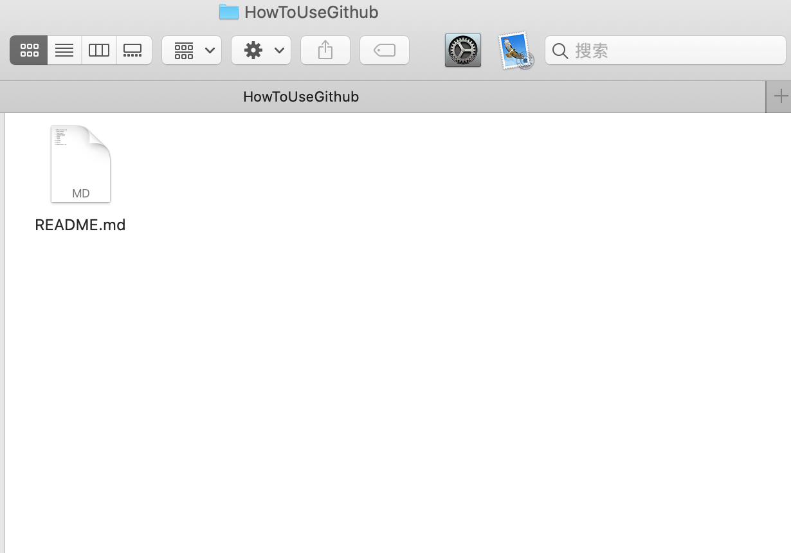
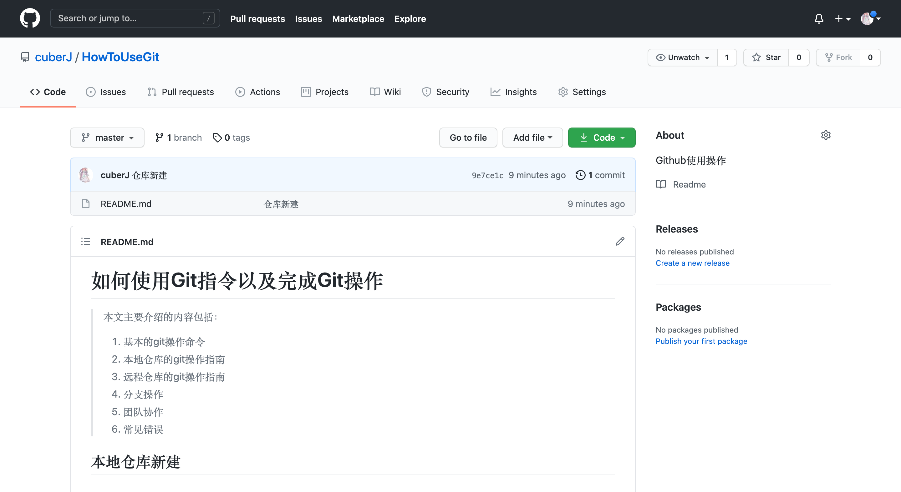

# 如何使用Git指令以及完成Git操作

> 本文主要介绍的内容包括：
>
> 1. 基本的git操作命令
> 2. 本地仓库的git操作指南
> 3. 远程仓库的git操作指南
> 4. 分支操作
> 5. 团队协作
> 6. 常见错误

## 本地仓库新建

### 初始化仓库

进入后面用来写代码的文件夹（图1）



<center>图1：本地需要建立git仓库的文件夹</center>

执行命令：

```shell
git init # 初始化仓库
```

完成仓库初始化操作

然后去Github创建一个新的仓库

我这里叫做HowToUseGithub，选择仓库属性为公开/私人，然后添加描述，最后确认，得到一个远程托管仓库（图2）



<center>图2：远程托管仓库完成建立</center>

然后将这个托管仓库的网址（建议选择git打头的ssh地址，比如当前的这个仓库：git@github.com:cuberJ/HowToUseGit.git）复制，进入git界面，执行命令：

```shell
git remote add gitnote git@github.com:cuberJ/HowToUseGit.git
# gitnote是我对这个链接的一个代号，后面每次提交的时候，就可以不用输入网址，而是通过这个代号直接提交给这个仓库
```

添加成功，就可以开始在本地增删改查文件了。


### 文件修改

首先，如果我们新建了一个文件README.md，并在里面写了一些内容，就需要将这些内容先提交到缓冲区：

```shell
git add README.md # 如果文件很多，且所有的文件都需要提交到缓冲区，可以用下面的写法：
git add *
```

提交到缓冲区的文件并没有最终记录，只是为后面的提交做了一个准备。最终正式提交需要执行如下指令：

```shell
# 最简单的提交方式：
git commit -m 'first commit' README.md # 引号内为提交的注释
# 提交还有一种方式：
git commit
# 随后进入一个vim编辑器，在这里可以写一些较长的描述性文档（图3）
# 输入完需要编辑的文档后，按ESC进入命令行模式，然后输入大写的ZZ或者:wq保存退出
# 退出后，git会直接提交所有缓冲区内的文件
```

提交完成后，系统会为该次提交生成一个hash值标签。提交后的记录将会保留在仓库中作为一个log，用于后续倒推版本历史。

