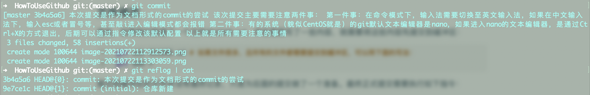
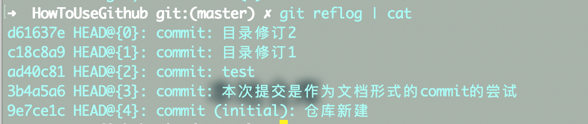
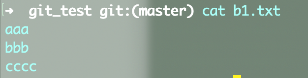
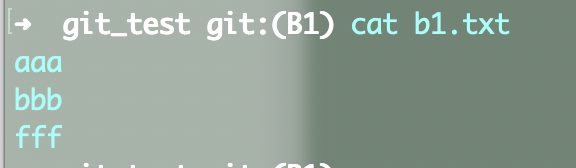
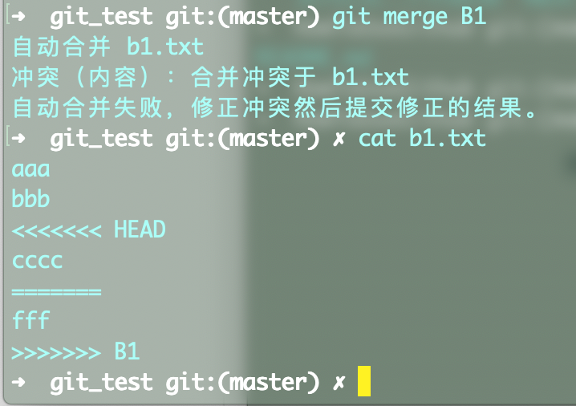
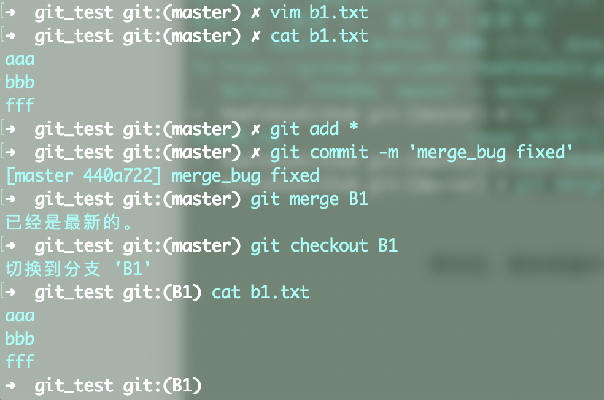

# 如何使用Git指令以及完成Git操作

## 目录

> 本文主要介绍的内容包括：
>
> 1. [基本的git操作命令](#基本git操作命令)
>    1. [新建个人账号](#新建个人账号)
> 2. [本地仓库](#本地仓库)
>    1. [初始化仓库](#初始化仓库)
>    2. [文件修改](#文件修改)
>    3. [文件版本回退和回回退](#文件版本回退和回回退)
>       1. [log历史查询](#log历史查询)
>       2. [回退](#回退)
>       3. [回回退](#回回退)
> 3. [远程仓库的git操作指南](#远程仓库操作指南)
> 4. [分支操作](#分支操作)
>    1. [创建分支与分支的效果](#创建分支与分支的效果)
> 5. 团队协作


## 基本git操作命令

### 新建个人账号


## 本地仓库

### 初始化仓库

进入后面用来写代码的文件夹（图1）


<center>图1：本地需要建立git仓库的文件夹</center>

执行命令：

```shell
git init # 初始化仓库
```

完成仓库初始化操作

然后去Github创建一个新的仓库

我这里叫做HowToUseGithub，选择仓库属性为公开/私人，然后添加描述，最后确认，得到一个远程托管仓库（图2）


<center>图2：远程托管仓库完成建立</center>

然后将这个托管仓库的网址（建议选择git打头的ssh地址，比如当前的这个仓库：git@github.com:cuberJ/HowToUseGit.git）复制，进入git界面，执行命令：

```shell
git remote add gitnote git@github.com:cuberJ/HowToUseGit.git
# gitnote是我对这个链接的一个代号，后面每次提交的时候，就可以不用输入网址，而是通过这个代号直接提交给这个仓库
```

添加成功，就可以开始在本地增删改查文件了。


### 文件修改

首先，如果我们新建了一个文件README.md，并在里面写了一些内容，就需要将这些内容先提交到缓冲区：

```shell
git add README.md # 如果文件很多，且所有的文件都需要提交到缓冲区，可以用下面的写法：
git add *
```

提交到缓冲区的文件并没有最终记录，只是为后面的提交做了一个准备。最终正式提交需要执行如下指令：

```shell
# 最简单的提交方式：
git commit -m 'first commit' README.md # 引号内为提交的注释
# 提交还有一种方式：
git commit
# 随后进入一个vim编辑器，在这里可以写一些较长的描述性文档（图3）
# 输入完需要编辑的文档后，按ESC进入命令行模式，然后输入大写的ZZ或者:wq保存退出
# 退出后，git会直接提交所有缓冲区内的文件
```

提交完成后，系统会为该次提交生成一个hash值标签。提交后的记录将会保留在仓库中作为一个log，用于后续倒推版本历史。



<center>图3：可以生成一个长文档，长文档的第一行文字会作为标题保存在log日志中</center>


### 文件版本回退和回回退


#### log历史查询

文件需要回退至历史版本时，通过hash值确定回退的历史版本

图4中列出了文档目前的所有提交记录。查看提交记录的方式有两种：

```shell
# Windows系统下的git执行操作时，不会出现页面跳转，所以直接输入指令即可；macOS下会出现一次跳转，可以通过管道的方式用cat指令直接展示
git reflog  # reflog模式展示hash值标签的前7位和Head指针，以及简短的commit记录
git reflog | cat # macOS下均采用这种格式在原地展示

# 第二种方式：
git log # 最完整的展示方式
git log --pretty=oneline # 将每次的commit记录放在一行展示，节约展示空间
```



<center>图4：commit记录展示</center>


#### 回退

需要回退到历史中某个版本时期，可以通过如下指令操作：

```shell
git reset --hard c18c8a9
```

可以回退到hash值为c18c8a9（图4中HEAD{1}的位置）时的文件版本

`--hard`的选项可以替换为`--medium`或者`--soft`，soft不会重置缓冲区，--hard会清空缓冲区


#### 回回退

如果回退后觉得还是新版本的好，还可以重新通过输入hash值返回新版本。回退的操作不会清空commit记录

如果不确定回退几轮，可以通过如下方式操作

```shell
git reset --hard^^^ # hard后面有几个尖角号，就表示回退几个版本
# 如果需要回退的版本很多，还可以这样操作：
git reset --hard~3 # 一样表示回退3个版本
```

回退的本质是修改HEAD指针，HEAD{0}表示最新的修改，移动后HEAD会停留在对应版本的hash值前


## 远程仓库操作指南

之前在[初始化仓库](###初始化仓库)中已经完成了一个Github的仓库创建，现在我们要把数据同步到这个仓库中

执行操作:

```shell
git push gitnote master
```

可以将该仓库推送至该仓库的主分支，即master分支上

如果在另一台电脑上需要获取该仓库的内容，可以采用两种方式：

```shell
git clone 网址 master # 直接克隆整个仓库master分支的内容
git pull 网址 master # 如果是两台电脑同时对一个项目进行维护，那么就可以通过这个方式同步更新的内容
```


## 分支操作

Github关于分支的理念如下：

1. 任务分配的时候，每个分支的人尽量负责独立的文件，尽量不要两个分支上的人同时修改一个文档，否则会经常出现merge错误
2. 如果修改了同一个文档，只要不是修改的同一行，就不会报错。所以模块化的分工也是必要的


### 创建分支与分支的效果

创建分支的指令如下：

```shell
git branch B1 # 创建名为B1的分支
git branch -v # 查看所有分支信息
git checkout B1 # 切换到B1分支
```

此时创建的B1会克隆整个当前分支的内容，后面的所有修改都是源自当前分支（不一定是master分支，每个分支都可以创建自己的分支）。

分支创建后，在分支下修改的内容在未提交前，对于所有分支均可见。但如果commit成功之后，该修改仅对当前分支可见，其他分支仅能查看到自己的分支内容。


### 分支合并

merge方式允许分支合并至上一级的分支。

```shell
git:(master) : git merge B1  # 将B1分支的修改合并至主分支
```

如果B1分支和主分支均修改了文件delete.txt中的相同行，那么merge会报错，提示合并冲突。此时该冲突必须通过人工删除的方式消除。

消除的方式如下：

如图5，图6所示，master分支下，文件b1.txt中最后一行为cccc；而在分支B1中，b1.txt的最后一行为fff。此时两个分支的修改均已提交。



<center>图5</center>



<center>图6</center>

如果需要合并B1至master，那么会出现报错，且文件b1.txt会被修改为如下格式（图7）：



<center>图7：冲突的部分会用连续箭头标注出来，可以在master分支下直接修改该冲突文件，将箭头扇区并人工选择两组箭头之间需要保留的部分，再次add提交即可</center>

修改后，假如保留fff，删除cccc，那么修改结果如下（图8）：



<center>图8：修改文件如cat所示，然后重新add ，commit，就可以执行merge操作。merge后切换至B1，文件已经修改完毕</center>

> 如果master和B1分支修改的内容不在同一个文件上，或者修改的内容在同一文件的不同行，合并会顺利执行
>
> > 比如master修改了b1.txt的第一行aaa为aaaa，B1分支修改了第二行为bbbb，那么合并不会报错，因为没有冲突

